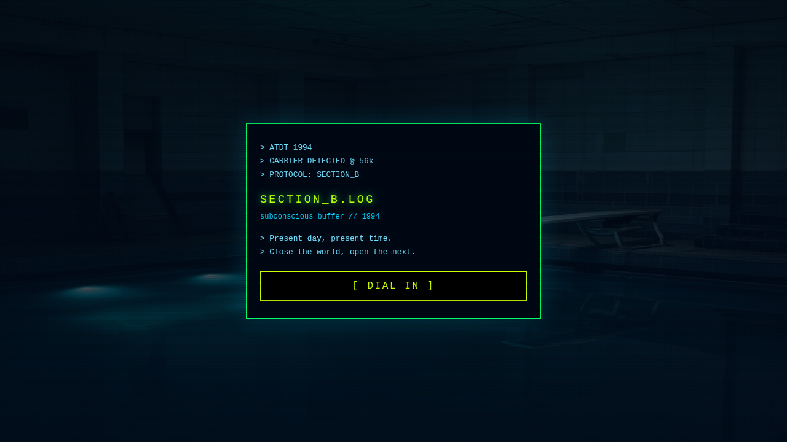
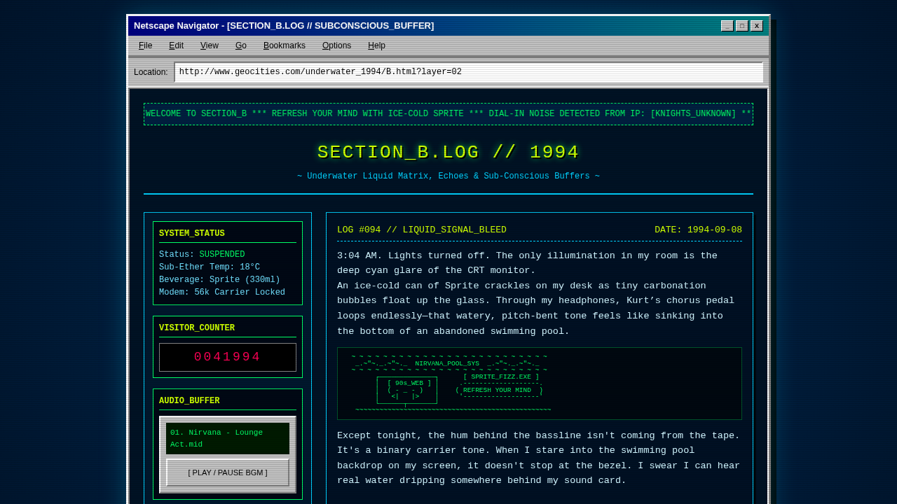
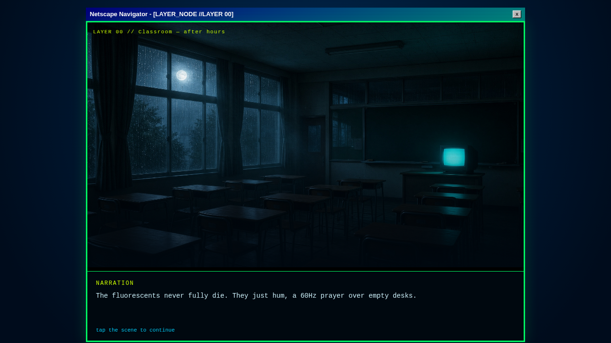
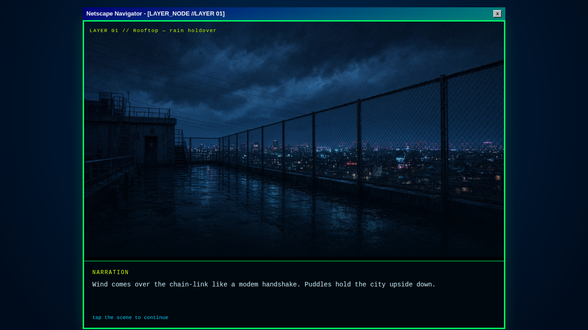
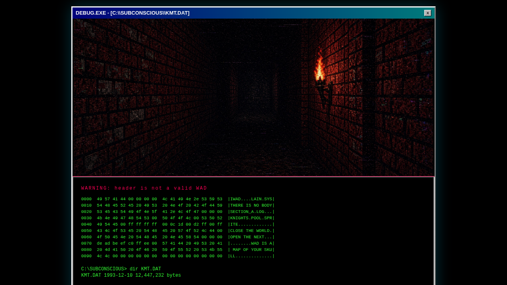
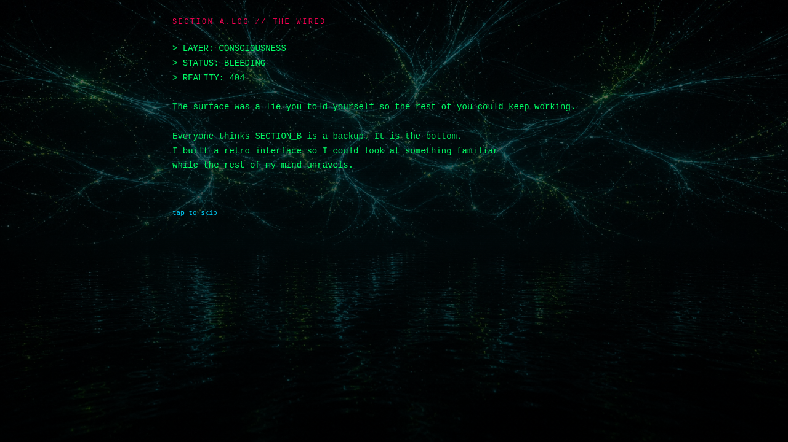

# SECTION_B.LOG

**by [Windsweet97](https://github.com/Windsweet97)**

Present day. Present time. Close the world, open the next.

A 1994 Netscape-shell visual novel / ARG. Dial in, wander Nirvana Pool, leak into the Wired, and keep clicking until the inner layer opens.

<p align="center">
  
</p>

## Layers

| Layer | What you find |
| --- | --- |
| **SECTION_B** | Retro homepage: guest book, packet dump, hidden links |
| **THE WIRED** | Branching visual novel — classroom → rooftop → the node |
| **KMT.DAT** | Hex dump of a WAD that is a map of your skull |
| **SECTION_A** | Consciousness bleed, 70ms teletype |

Secrets unlock when you read the packet, find the girl, and visit the Knights.

## Screenshots

<p align="center">
  
</p>

<p align="center">
  
  
</p>

<p align="center">
  
  
</p>

## Run locally

```bash
npm install
npm run dev
```

Then open [http://localhost:8080](http://localhost:8080).

```bash
npm run build      # production build
npm run typecheck
npm run test
```

Stack: TanStack Start, React 19, Vite, Zustand, Tailwind.

## Routes

| Path | What it is |
| --- | --- |
| `/` | Boot modem → SECTION_B surface / inner |
| `/wired?node=start` | Visual novel |
| `/kmt` | DEBUG.EXE hex dump |
| `/section-a` | Teletype dump |
